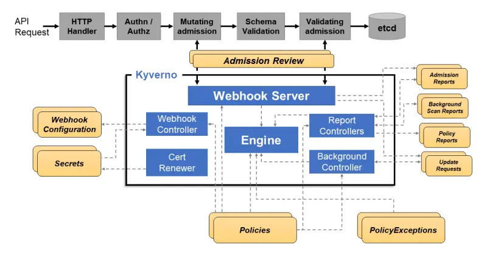

# Kyverno
[Kyverno](https://kyverno.io/) (Greek for "govern") is a policy engine specifically designed for Kubernetes. It is a Cloud Native Computing Foundation (CNCF) project that enables teams to collaborate and enforce Policy-as-Code.

Kyverno operates as a [Dynamic Admission Controller](https://kubernetes.io/docs/reference/access-authn-authz/extensible-admission-controllers/) in a Kubernetes Cluster. It receives validating and mutating admission webhook HTTP callbacks from the Kubernetes API server and applies matching policies to return results that enforce admission policies or reject requests. It can also be used to audit requests and monitor the security posture of the environment before enforcement.

Some example usages of Kyverno are:
* Check for required labels
* Enforcing Pod Security Standards
* Strategic patch of existing resources
* Restricting images from unknown registries
* Adding data to ConfigMaps
* Setting tolerations



## Creating Policies
Kyverno has two kinds of Policy resources: `ClusterPolicy` used for Cluster-Wide Resources and `Policy` used for Namespaced Resources.

[Here](../../manifests/security/kyverno/require-labels-policy.yaml) is a sample policy requiring a Label `CostCenter`. Create the policy using the following command:
```bash
kubectl apply -f manifests/security/kyverno/require-labels-policy.yaml
```

> ![NOTE]
> The running Pods doesn't have the required Label, and Kyverno didn't terminate it. This is because Kyverno operates as an Admission Controller and won't interfere with resources that already exist in the cluster.

If you delete a running Pod, it won't be able to be recreated since it doesn't have the required Label.

### Mutating Rules

[Here](../../manifests/security/kyverno/add-labels-mutation-policy.yaml) is a sample policy with a mutation rule defined, which will be used to automatically add our label `CostCenter=IT` as default to any Pod. Create the policy using the following command:
```bash
kubectl apply -f manifests/security/kyverno/add-labels-mutation-policy.yaml
```

## Enforcing Pod Security Standards
The Kubernetes [Pod Security Standards (PSS)](https://www.eksworkshop.com/docs/security/pod-security-standards/) define three policy levels: **Privileged**, **Baseline**, and **Restricted**. Go ahead and apply the Baseline Policy cluster wide:
```bash
kubectl apply -f manifests/security/kyverno/baseline-policy.yaml
```

The Baseline Policy will prevent known privileged escalations such as containers accessing HostProcess, HostPath, HostPorts, or allowing traffic snooping.

## Restricting Image Registries
Kyverno can help you run secure container workloads by restricting the image registries that can be used in your cluster.

 In [this example](../../manifests/security/kyverno/restrict-image-registries.yaml) we'll use the [Amazon ECR Public Gallery](https://public.ecr.aws/) as our trusted registry, blocking any containers that use images hosted in other registries.
```bash
kubectl apply -f manifests/security/kyverno/restrict-image-registries.yaml
```

## Reports and Auditing
Kyverno includes a [Policy Reporting](https://kyverno.io/docs/policy-reports/) tool that uses an open format defined by the Kubernetes Policy Working Group. These reports are deployed as custom resources in the cluster.

Kyverno generates these reports automatically when admission actions like CREATE, UPDATE, and DELETE are performed in the cluster. Reports are also generated as a result of background scans that validate policies on existing resources.

Let's examine our cluster's compliance status with the policies we've created so far in this workshop by reviewing the Policy Reports generated.
```bash
kubectl get policyreports -A
```

To examine the violations for a Policy in more detail, you can use the `kubectl describe policyreport` command.

> ![INFO]
> Kyverno also supports a GUI-based tool for [Policy reporter](https://kyverno.github.io/policy-reporter/core/targets/#policy-reporter-ui)